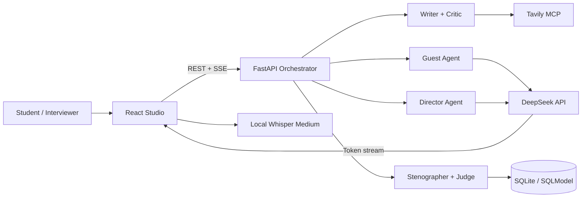

# Newsroom Interview Lab

**Local-first multi-agent AI interview training platform powered by DeepSeek, Tavily MCP, Whisper, FastAPI, React and Server-Sent Events.**

Newsroom Interview Lab（新闻采访训练智能体）是一个面向新闻传播、媒体教育、主持训练和 AI Agent 教学的开源项目。系统从真实公开来源生成采访场景，让多个智能体分别承担资料编辑、模拟嘉宾、实时导播、客观速记和复盘评委等角色，形成“检索资料 → 限时采访 → 流式回答 → 导播耳返 → 量化复盘 → 长期学习”的完整训练闭环。

> 本仓库的主要应用位于 [`newsroom/`](newsroom/)。完整安装、配置、接口和故障排查说明请阅读 [Newsroom 详细文档](newsroom/README.md)。

## Why Newsroom

普通聊天机器人通常只生成一段回答；Newsroom 把采访训练建模为一个有时间、有隐藏事实、有角色策略、有状态变化和可验证结果的多智能体任务：

- **Grounded scenario generation**：Tavily HTTP MCP 检索真实来源，Writer/Critic 与代码门禁阻止无来源内容进入训练；
- **Adaptive interview guest**：Guest 根据问题压力、事实防线和连续追问动态决定回避、松口或完整释放；
- **Real token streaming**：DeepSeek 返回的内容块通过 SSE 原样增量推送，不使用完整回答后的伪打字效果；
- **Safe director earpiece**：Director 提供短促可执行的采访提示，并经过节流和隐藏事实防泄漏检查；
- **Local speech-to-text**：ModelScope Whisper Medium 在本机完成中文语音转录；
- **Auditable evaluation**：客观指标由代码计算，Judge 的语义评分必须引用真实回合证据；
- **Cross-session learning**：SQLite Profile 记录慢性弱点、历史指标和人设成绩，反哺下一场训练。

## Project Links

| 入口 | 内容 |
| --- | --- |
| [完整中文 README](newsroom/README.md) | 产品、架构、环境变量、局域网 HTTPS、API、测试和排障 |
| [Documentation Index](newsroom/docs/README.md) | 架构、时序、记忆、语音与 Prompt 文档导航 |
| [Interview Sequence](newsroom/docs/sequence.md) | 会话状态机、并发编排、持久化和 SSE 时序 |
| [Memory Design](newsroom/docs/memory-design.md) | 对话历史、FactState 与跨场 Profile 三层记忆 |
| [Speech Pipeline](newsroom/docs/speech-design.md) | Whisper 下载、校验、解码、推理和浏览器限制 |
| [Prompt Changelog](newsroom/docs/prompt-changelog.md) | Prompt 规则和行为变更记录 |

## Architecture at a Glance



## Quick Start

Windows PowerShell：

```powershell
cd newsroom\backend
Copy-Item .env.example .env
# 编辑 .env，填写 LLM 与 Tavily 的真实凭据
uv sync
uv run uvicorn app.main:app --host 0.0.0.0 --port 8000
```

新开一个终端：

```powershell
cd newsroom\frontend
npm ci
npm run dev
```

访问 `https://localhost:5173`。首次使用 Whisper 时需要下载约 3GB 模型权重；局域网麦克风访问还需要包含局域网 IP 且被客户端信任的 mkcert 证书。完整步骤见 [快速开始](newsroom/README.md#快速开始) 与 [HTTPS/局域网配置](newsroom/README.md#https-与局域网访问)。

## Technology Keywords

本项目覆盖下列可检索主题：

| 类别 | 中文关键词 | English keywords |
| --- | --- | --- |
| 智能体 | AI 智能体、多智能体协作、角色智能体、Agent 状态机 | AI agent, multi-agent system, agent orchestration, stateful agent |
| 新闻教育 | 新闻采访训练、模拟采访、导播耳返、主持人训练 | interview training, newsroom simulator, journalism education, interviewer coaching |
| 真实链路 | 事实锚定、来源追溯、真实性门禁、工具增强生成 | grounded generation, source attribution, fact checking, tool-augmented LLM |
| 模型与工具 | DeepSeek、Tavily MCP、Model Context Protocol、Whisper | DeepSeek, Tavily MCP, Model Context Protocol, Whisper speech-to-text |
| Web 技术 | FastAPI、React、TypeScript、SSE、SQLite | FastAPI, React, TypeScript, Server-Sent Events, SQLite |
| 部署形态 | 本地优先、局域网 AI、本地语音识别 | local-first AI, LAN deployment, local speech recognition |

建议的 GitHub Topics：

```text
ai-agent
multi-agent
interview-training
journalism-education
newsroom-simulator
deepseek
tavily
mcp
whisper
fastapi
react
server-sent-events
local-first
```

建议的 GitHub About 描述：

```text
Local-first multi-agent AI interview training platform with grounded news search, adaptive guests, director coaching, Whisper transcription and auditable review.
```

## Current Scope

当前版本针对 Windows 本机与小规模局域网训练，使用单个 Uvicorn 进程、SQLite 和 Vite HTTPS。它不是已完成认证、权限、限流、备份与多节点扩容的公网 SaaS。生产边界、数据安全和已知限制详见 [完整 README](newsroom/README.md#已知边界)。

## Search Aliases

Newsroom Interview Lab 也可以通过以下名称理解和检索：

- 新闻采访训练智能体 / AI 采访陪练 / 智能采访模拟器；
- 多智能体新闻演播室 / 新闻教育 Agent / 主持人训练系统；
- Multi-Agent Interview Coach / AI Newsroom Simulator；
- Grounded Interview Training Agent / Journalism Education AI；
- DeepSeek Interview Agent with Tavily MCP and Whisper。
