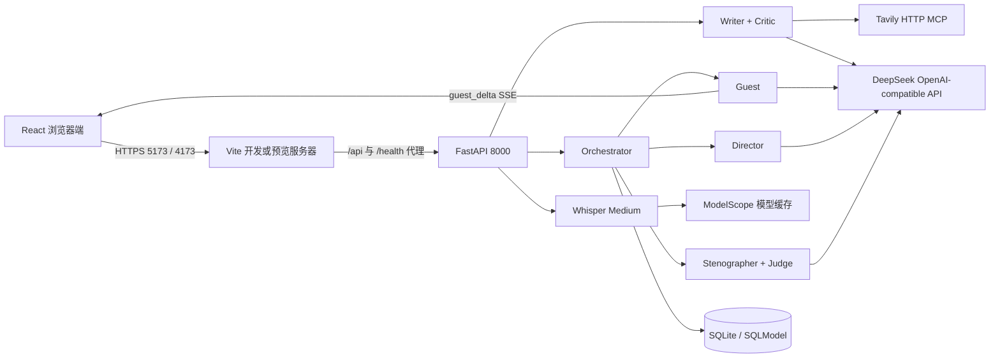
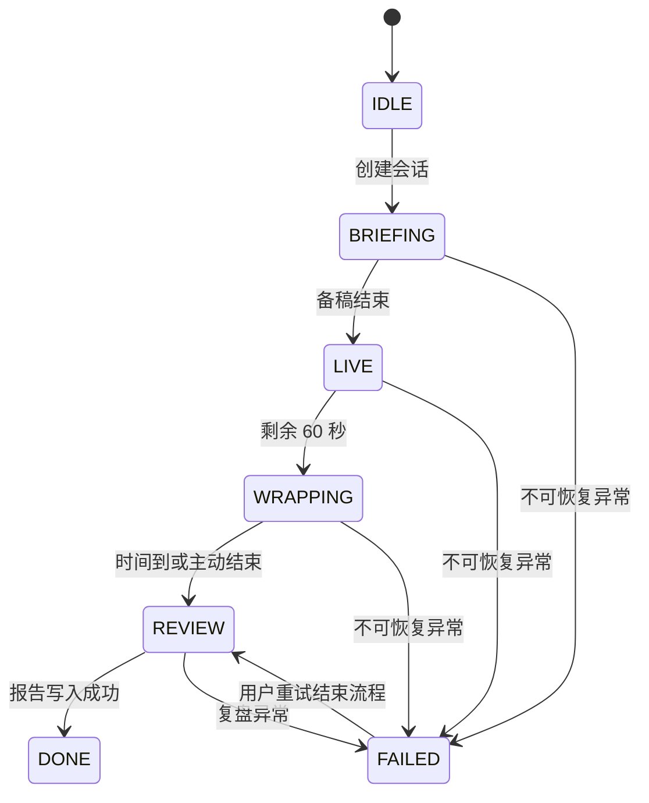

# Newsroom Interview Lab

> **Local-first multi-agent AI interview training platform with grounded news search, adaptive interview guests, real-time director coaching, Whisper speech-to-text and auditable performance review.**

Newsroom 是一个面向新闻采访训练的本地多智能体应用。用户输入新闻主题后，系统会从真实公开来源生成采访场景，在限时演播室中扮演会回避、会松口、会逐步暴露事实的嘉宾，同时提供不泄题的导播耳返；采访结束后，再生成逐轮回放、客观指标、五维评分和跨场成长对比。

当前版本以 **Windows 本机和局域网运行** 为主要目标，默认接入以下真实链路：

- 大模型：DeepSeek OpenAI 兼容接口，默认模型 `deepseek-v4-flash`；
- 新闻检索：Tavily HTTP MCP，生产模式不会静默回退到 fixture；
- 语音转录：ModelScope `openai-mirror/whisper-medium`，本地 PyTorch 推理；
- 前后端通信：FastAPI REST + SSE，嘉宾回答按供应商返回的内容块增量展示；
- 数据持久化：SQLite + SQLModel，服务重启后可恢复会话与报告。

> 真实性边界：系统保证训练场景的事实材料必须能够追溯到公开来源，但“模拟嘉宾”的措辞仍是生成内容，不能直接视为现实人物的正式表态。复盘页会公开本场使用的来源与隐藏事实。

## 目录

- [项目定位与关键词](#项目定位与关键词)
- [产品流程](#产品流程)
- [核心能力](#核心能力)
- [系统架构](#系统架构)
- [技术栈](#技术栈)
- [项目结构](#项目结构)
- [环境要求](#环境要求)
- [快速开始](#快速开始)
- [环境变量](#环境变量)
- [HTTPS 与局域网访问](#https-与局域网访问)
- [运行生产预览](#运行生产预览)
- [接口说明](#接口说明)
- [数据与日志](#数据与日志)
- [测试与构建](#测试与构建)
- [常见问题](#常见问题)
- [已知边界](#已知边界)
- [开发原则](#开发原则)

## 项目定位与关键词

### 中文定位

Newsroom Interview Lab 是一个“新闻采访训练智能体 / AI 采访陪练 / 多智能体演播室”项目，适合新闻传播教学、主持人训练、媒体从业者采访演练、大模型 Agent 课程实验以及人机交互研究。它不是简单的角色聊天页面，而是把真实检索、事实状态、限时任务、流式交互、过程指导、量化评价和跨场学习组合成一套可运行、可复盘的训练系统。

### English Overview

Newsroom Interview Lab is a local-first, stateful multi-agent interview training application. It combines grounded scenario generation through Tavily MCP, adaptive guest behavior powered by DeepSeek, real token streaming over Server-Sent Events, local Whisper speech recognition, deterministic interview metrics, evidence-checked LLM review, and persistent cross-session learning. The project is designed for journalism education, interviewer coaching, AI agent coursework, and research on human-AI training systems.

### 适用场景

| 使用者 | 典型用途 | 系统提供的价值 |
| --- | --- | --- |
| 新闻传播专业学生 | 练习追问、倾听、现场控制和收尾 | 限时模拟、隐藏事实、导播耳返与逐轮复盘 |
| 教师与培训者 | 设计可重复的情境训练 | 来源可追溯、指标统一、跨场成长对比 |
| 媒体从业者 | 演练发布会、高压访谈和争议议题 | 多种回避人设、证据型追问和问题改写建议 |
| AI Agent 学习者 | 学习工具调用、记忆、编排和评估 | 完整 FastAPI/React 多智能体工程样例 |
| 人机交互研究者 | 观察实时指导如何影响用户行为 | 持久化逐字稿、提示执行情况和客观指标 |

### 与普通 LLM 聊天应用的区别

| 普通聊天应用 | Newsroom Interview Lab |
| --- | --- |
| 一次输入生成一次回答 | 状态机管理备稿、采访、收尾、复盘和失败恢复 |
| 模型自行决定说什么 | 代码先决定事实释放动作，模型只负责授权范围内的措辞 |
| 资料可能只存在 Prompt 中 | Tavily 来源、证据片段和 Dossier 被结构化持久化 |
| 完整回答生成后模拟打字 | 供应商 content chunk 通过 SSE 实时到达浏览器 |
| 给出泛化建议 | 指标、回合、引文、导播提示和建议形成可审计证据链 |
| 每次会话互相独立 | Profile 将连续弱点和上一场建议带入后续训练 |

### Search Keywords

`AI Agent` · `multi-agent system` · `interview training` · `newsroom simulator` · `journalism education` · `interviewer coaching` · `grounded generation` · `fact checking` · `DeepSeek` · `Tavily MCP` · `Model Context Protocol` · `Whisper speech-to-text` · `FastAPI` · `React` · `Server-Sent Events` · `local-first AI`

中文检索词：`AI 智能体`、`多智能体系统`、`新闻采访训练`、`模拟采访`、`采访陪练`、`导播耳返`、`事实锚定`、`来源追溯`、`本地语音识别`、`局域网 AI 应用`。

仓库入口与英文关键词汇总见 [根目录 README](../README.md)，全部设计文档见 [Documentation Index](docs/README.md)。

## 产品流程

1. 在首页输入新闻主题，Writer 通过 Tavily 搜索 3–5 个公开来源。
2. Writer 生成公开简报、嘉宾人设、隐藏事实、事实防线和解锁提示；Critic 与代码门禁负责真实性和可玩性检查。
3. 用户选择场景并创建会话，进入默认 60 秒的备稿阶段。
4. 正式采访默认持续 8 分钟，最后 60 秒进入收尾阶段。
5. 用户可直接输入文字、使用麦克风录音，或上传音频文件转录后再发送。
6. Guest 根据问题压力、目标事实、连续追问次数和人物性格决定回避、露破绽、部分释放或完整释放。
7. Director 在必要时给出短促耳返，并经过防泄题和提示节流检查。
8. 采访结束后，Stenographer 计算客观指标，Judge 输出带证据的五维评分和下一场建议。
9. 本场表现写入学生 Profile，供下一场的导播重点和跨场对比使用。

前端页面：

| 路径 | 说明 |
| --- | --- |
| `/` | 主题输入、场景生成与会话创建 |
| `/studio?session=<session_id>` | 备稿、限时采访、语音输入和导播耳返 |
| `/review/<report_id>` | 五维评分、逐轮回放、客观指标、完整档案与成长对比 |

## 核心能力

### 1. 真实来源驱动的场景生成

- `TAVILY_MODE=real` 时必须成功调用真实搜索服务；缺少凭据或搜索失败会明确报错。
- Writer 至少需要 3 个不同公开来源，最多使用 5 个结果。
- 事实内容、来源 URL 和证据片段会被服务端重新归一化，模型不能通过随意附上真实 URL 来伪装事实支撑。
- Writer Critic 会检查事实防线梯度、解锁提示、公开简报一致性和可玩性。
- 未通过真实性门禁的 Dossier 不会写入数据库，也不会出现在场景列表中。

### 2. 确定性事实状态机

每条隐藏事实都对应一个 `FactState`：

- `guard_current`：当前防线强度，范围为 0–5；
- `consecutive_probes`：对同一事实的连续追问次数；
- `revealed`：`hidden`、`partial`、`full` 三态。

LLM 负责识别问题压力和目标事实，代码负责更新防线并决定允许的动作。事实是否解锁不依赖模型“记得没记得”，从而避免重试、上下文裁剪或并发调用造成状态漂移。

### 3. 真实流式回答

实时嘉宾链路不是在完整回答生成后做逐字播放：

```text
DeepSeek content chunk
        ↓
LLM Gateway 异步读取流
        ↓
on_delta 回调
        ↓
SSE guest_delta
        ↓
浏览器增量追加文本
```

最终 `guest_done` 事件补齐舞台动作、目标事实、动作类型和完整文本。前端使用 `request_id` 对齐同一次提交，避免重连或完成事件造成重复内容。

### 4. 实时导播与防泄题

- Director 读取最近对话、当前 GuestOutput 和学生长期弱点；
- 正确且持续加压的追问会让导播保持安静；
- 普通提示受轮次节流控制，紧急提示可以越过节流；
- 提示文本会与尚未完全揭示的事实做相似度检查；
- 不安全提示会被丢弃，必要时替换为不含答案的固定动作提示。

### 5. 本地 Whisper 语音转录

- 模型：`openai-mirror/whisper-medium`；
- 来源：ModelScope；
- 推理：本地 CUDA FP16 或 CPU；
- 解码：PyAV，统一重采样为 16kHz 单声道；
- 单文件最大 25MB；默认最长 90 秒；
- 上传内容在内存中解码，不主动落盘；
- 模型按进程懒加载，可通过 warmup 接口提前预热。

### 6. 可审计复盘与长期记忆

客观指标由纯代码从逐字稿计算，包括：

- 开放式问题比例；
- 有效追问率与倾听度；
- 主持人话语占比；
- 平均问题长度、长问题和多问合一；
- 诱导式提问与口头禅；
- 找到的事实数量和信息价值。

Judge 只对需要语义判断的维度进行解释与评分；“信息收获”由代码根据事实发现率和料值计算。评委引用的回合与短引文还会再次与逐字稿核对。

学生记忆分为三层：

| 层级 | 生命周期 | 作用 |
| --- | --- | --- |
| 对话历史 | 单场 | 保证上下文承接与逐轮回放 |
| `fact_state` | 单场 | 作为事实释放进度的唯一可信状态 |
| `profile` | 跨场 | 保存历史指标、慢性弱点、口头禅和人设最高分 |

慢性弱点需要在最近连续 3 场都触发阈值才会进入 Profile，避免一场偶然失误被永久标签化。

## 系统架构



主要角色：

| 模块 | 职责 | 关键约束 |
| --- | --- | --- |
| Writer | 搜索主题并生成 Dossier | 真实来源、结构化输出、Critic 复核 |
| Guest | 扮演嘉宾并流式回答 | 只能使用当前动作授权的事实 |
| Director | 给主持人耳返 | 15 字以内、防泄题、节流与静默规则 |
| Orchestrator | 会话、计时、事务、SSE 和恢复 | 手写状态机、单场锁、连续 turn 索引 |
| Stenographer | 整理逐字稿并计算指标 | 纯代码、相同输入得到相同结果 |
| Judge | 五维复盘和训练建议 | Schema 校验、证据回合校验、失败降级 |

会话状态：



更详细的时序和设计说明见：

- [访谈编排时序](docs/sequence.md)
- [三层记忆设计](docs/memory-design.md)
- [Whisper 真实语音链路](docs/speech-design.md)
- [Prompt 变更记录](docs/prompt-changelog.md)

## 技术栈

### 后端

- Python 3.11
- FastAPI / Uvicorn
- Pydantic / SQLModel / SQLite
- httpx
- jieba
- PyTorch CUDA 13.0
- Transformers / ModelScope / PyAV

### 前端

- React 19
- TypeScript
- Vite 7
- Zustand
- Recharts
- Tailwind CSS Vite 插件

### 外部与本地模型

- DeepSeek OpenAI 兼容 Chat Completions
- Tavily HTTP MCP 或 Tavily REST 兼容接口
- ModelScope `openai-mirror/whisper-medium`

## 项目结构

```text
newsroom/
├─ backend/
│  ├─ app/
│  │  ├─ agents/          # Writer、Guest、Director、Judge 与事实状态机
│  │  ├─ llm/             # 供应商配置、结构化输出、流式网关与调用日志
│  │  ├─ memory/          # 跨场学生 Profile
│  │  ├─ prompts/         # 独立 Markdown Prompt 与人物模板
│  │  ├─ speech/          # Whisper 配置、解码、推理与 API
│  │  ├─ tools/           # Tavily 搜索与确定性 Stenographer
│  │  ├─ database.py      # SQLite 引擎、WAL 与本地增量迁移
│  │  ├─ models.py        # SQLModel 数据表
│  │  ├─ orchestrator.py  # 会话状态机、SSE、计时和复盘编排
│  │  ├─ scenarios.py     # 场景生成 API
│  │  └─ main.py          # FastAPI 入口与健康检查
│  ├─ tests/              # unittest 自动化测试
│  ├─ .env.example        # 不含密钥的配置模板
│  └─ pyproject.toml
├─ frontend/
│  ├─ src/
│  │  ├─ components/      # 首页、演播室和复盘页
│  │  ├─ hooks/           # SSE 与语音转录 Hooks
│  │  ├─ store.ts         # Zustand 状态
│  │  └─ types.ts         # 前端接口类型
│  ├─ vite.config.ts      # HTTPS、5173/4173 和后端代理
│  └─ package.json
├─ docs/                  # 设计文档；运行时 LLM 日志目录被 Git 忽略
├─ runtime/               # 本地运行产物与日志，被 Git 忽略
└─ README.md
```

## 环境要求

### 必需软件

- Windows 10/11；
- Python 3.11；
- [uv](https://docs.astral.sh/uv/)；
- Node.js `^20.19.0` 或 `>=22.12.0`（与当前 Vite 7 的 `engines` 一致）；
- npm；
- 首次生成受信任证书时需要 Chocolatey 与 mkcert。

### 硬件建议

- 仅文本模式：普通开发机即可；
- Whisper CUDA：建议 NVIDIA GPU，并预留至少约 4GB 显存；
- Whisper 模型缓存：预留约 3GB 磁盘空间；
- 无可用 CUDA 时可设置 `WHISPER_DEVICE=cpu`，但首次加载和转录会明显变慢。

项目将 PyTorch 固定到 CUDA 13.0 官方源。安装后可用以下命令检查：

```powershell
cd backend
uv run python -c "import torch; print(torch.__version__); print(torch.cuda.is_available())"
```

## 快速开始

以下命令均从项目根目录 `newsroom` 开始。

### 1. 准备后端配置

```powershell
cd backend
Copy-Item .env.example .env
```

编辑 `backend/.env`，至少填写：

```dotenv
LLM_PROVIDER=deepseek
LLM_API_KEY=你的大模型密钥
LLM_BASE_URL=https://api.deepseek.com
LLM_FAST_MODEL=deepseek-v4-flash
LLM_SMART_MODEL=deepseek-v4-flash

TAVILY_MODE=real
TAVILY_MCP_URL=https://你的-tavily-mcp地址/mcp
TAVILY_API_KEY=你的Tavily密钥
```

DeepSeek 的 `LLM_BASE_URL` 保持为 `https://api.deepseek.com`，不要额外添加 `/v1`。网关会在其后请求 `/chat/completions`。

### 2. 安装并启动后端

```powershell
cd backend
uv sync
uv run uvicorn app.main:app --host 0.0.0.0 --port 8000
```

后端启动后先检查：

```powershell
Invoke-RestMethod http://127.0.0.1:8000/health | ConvertTo-Json -Depth 6
```

健康检查包含数据库、LLM、搜索与 Whisper 状态。`/health` 主要确认配置和最近一次错误；要验证 Whisper 权重能否真正加载，应执行 warmup：

```powershell
Invoke-RestMethod -Method Post http://127.0.0.1:8000/api/transcription/warmup |
  ConvertTo-Json -Depth 6
```

首次 warmup 会下载约 3GB 模型权重，时间取决于网络与磁盘速度。

### 3. 安装并启动前端开发服务器

新开一个 PowerShell：

```powershell
cd frontend
npm ci
npm run dev
```

默认地址：

- 本机：`https://localhost:5173`
- 局域网：`https://<本机局域网IP>:5173`

Vite 会把 `/api` 和 `/health` 代理到 `http://127.0.0.1:8000`，浏览器只需要访问前端端口。

### 4. 完成一场采访

1. 打开首页并输入至少 3 个字符的新闻主题；
2. 等待场景生成，检查公开简报和嘉宾信息；
3. 创建会话并进入演播室；
4. 备稿结束后提交文字或语音问题；
5. 至少完成一轮有效采访后才能主动结束；
6. 复盘生成完成后，页面会自动跳转到 `/review/<report_id>`。

## 环境变量

配置优先级为“进程环境变量 > `backend/.env` > 代码默认值”。不要把真实密钥写进 `.env.example`、README、截图或提交记录。

### LLM

| 变量 | 默认值 | 说明 |
| --- | --- | --- |
| `LLM_PROVIDER` | `deepseek` | 可选名称：`deepseek`、`qwen`、`kimi`、`glm`、`claude` |
| `LLM_API_KEY` | 无 | 通用 API Key；也支持 `DEEPSEEK_API_KEY` 等供应商前缀变量 |
| `LLM_BASE_URL` | 供应商默认值 | OpenAI 兼容服务根地址，不要以 `/` 结尾 |
| `LLM_FAST_MODEL` | `deepseek-v4-flash` | 实时评估、导播等延迟敏感任务 |
| `LLM_SMART_MODEL` | `deepseek-v4-flash` | 场景、嘉宾回答和复盘任务 |
| `LLM_TIMEOUT_SECONDS` | `60` | 单次 HTTP 请求超时 |
| `LLM_THINKING_TYPE` | 空 | 供应商支持时可设 `enabled`；实时链路会按代码关闭深度思考 |
| `LLM_REASONING_EFFORT` | 空 | 供应商支持时可设 `high` 等值 |
| `LLM_LOG_DIR` | `docs/llm-calls` | 每次 LLM 调用的审计日志目录 |

当前经过真实链路验证的是 DeepSeek OpenAI 兼容接口。切换其他供应商前，应确认其确实兼容 `/chat/completions`、SSE `data:` 分块格式和当前请求字段；仅修改 `LLM_PROVIDER` 不代表所有官方原生接口都能直接工作。

### Tavily

| 变量 | 默认值 | 说明 |
| --- | --- | --- |
| `TAVILY_MODE` | `real` | `real`/`auto` 均要求真实凭据；`fixture` 仅用于测试 |
| `TAVILY_MCP_URL` | 空 | 配置后优先使用 HTTP MCP |
| `TAVILY_API_KEY` | 无 | MCP 请求使用 `Authorization: Bearer ...` |
| `TAVILY_BASE_URL` | `https://api.tavily.com` | 未配置 MCP URL 时使用 REST 兼容接口 |

生产和正常体验应保持 `TAVILY_MODE=real`。真实模式缺少密钥、初始化失败、工具调用失败或结果不足都会直接返回错误，不会把测试 fixture 冒充为搜索成功。

### Whisper

| 变量 | 默认值 | 说明 |
| --- | --- | --- |
| `WHISPER_MODEL_ID` | `openai-mirror/whisper-medium` | ModelScope 模型 ID |
| `WHISPER_MODEL_REVISION` | 固定提交 | 锁定可复现版本 |
| `WHISPER_MODEL_SHA256` | 固定摘要 | 校验缓存权重完整性 |
| `WHISPER_DEVICE` | `auto` | `auto`、`cuda` 或 `cpu` |
| `WHISPER_LANGUAGE` | `zh` | 默认转录语言 |
| `WHISPER_MAX_AUDIO_SECONDS` | `90` | 最大音频时长 |
| `WHISPER_CACHE_DIR` | `./.cache/modelscope` | 相对 `backend` 解析的缓存目录 |

### 前端

| 变量 | 默认值 | 说明 |
| --- | --- | --- |
| `VITE_HTTPS` | `true` | 设为 `false` 可临时关闭 HTTPS，仅建议本机无麦克风调试 |

## HTTPS 与局域网访问

浏览器的麦克风 API 需要安全上下文。`localhost` 通常被特殊视为安全来源，但局域网 IP 必须使用浏览器信任且 SAN 包含该 IP 的 HTTPS 证书。

### 仅本机证书

```powershell
choco install mkcert -y
mkcert -install
cd frontend
mkcert -cert-file localhost+2.pem `
  -key-file localhost+2-key.pem `
  localhost 127.0.0.1 ::1
```

Vite 会优先读取：

- `frontend/localhost+2.pem`
- `frontend/localhost+2-key.pem`

若文件不存在，Vite 会生成临时自签名证书；临时证书适合页面调试，但不一定能让局域网设备正常申请麦克风权限。

### 局域网证书

先通过 `ipconfig` 找到本机局域网 IPv4，例如 `192.168.1.23`，然后把 IP 加入证书：

```powershell
cd frontend
$lanIp = "192.168.1.23"
mkcert -cert-file localhost+2.pem `
  -key-file localhost+2-key.pem `
  localhost 127.0.0.1 ::1 $lanIp
```

其他设备还必须信任 mkcert 根证书。运行 `mkcert -CAROOT` 找到 `rootCA.pem`，只把公有根证书安装到测试设备；**不要复制或分享 `rootCA-key.pem`**。当局域网 IP 改变时，需要重新生成包含新 IP 的站点证书。

Windows 防火墙需允许前端端口 5173（开发）或 4173（预览）。局域网设备通常不需要直接访问 8000，因为 API 由 Vite 代理。

## 运行生产预览

第一版推荐使用“单个 Uvicorn 后端 + Vite 构建预览”进行本机或局域网验收。

后端：

```powershell
cd backend
uv run uvicorn app.main:app --host 0.0.0.0 --port 8000
```

前端：

```powershell
cd frontend
npm ci
npm run build
npm run preview
```

访问：

- 本机：`https://localhost:4173`
- 局域网：`https://<本机局域网IP>:4173`

注意：

- Vite Preview 适合本地验收，不等同于面向互联网的生产 Web Server；
- 当前 Orchestrator 的 SSE 订阅者和运行时锁保存在单进程内，不要直接开启多个 Uvicorn worker；
- 如后续增加 Nginx/Caddy，必须关闭 SSE 路径的响应缓冲，并保持 `Cache-Control: no-cache`；
- SQLite 已启用 WAL 与 30 秒 busy timeout，适合当前单机范围，不是多节点数据库方案。

## 接口说明

### REST API

| 方法 | 路径 | 作用 |
| --- | --- | --- |
| `GET` | `/health` | 数据库、LLM、搜索与 Whisper 健康检查 |
| `GET` | `/api/scenarios` | 列出通过真实性检查的场景 |
| `POST` | `/api/scenarios/generate` | 根据主题生成新场景 |
| `POST` | `/api/session` | 创建采访会话 |
| `GET` | `/api/session/{id}` | 获取会话快照 |
| `GET` | `/api/session/{id}/history` | 获取持久化回合与事实发现状态 |
| `GET` | `/api/session/{id}/stream` | 建立 SSE 事件流 |
| `POST` | `/api/session/{id}/turn` | 提交主持人问题 |
| `POST` | `/api/session/{id}/end` | 主动结束并生成复盘 |
| `GET` | `/api/review/{report_id}` | 获取公开复盘数据 |
| `GET` | `/api/transcription/status` | 获取 Whisper 加载状态 |
| `POST` | `/api/transcription/warmup` | 预热 Whisper |
| `POST` | `/api/transcription` | 上传并转录音频 |

生成场景：

```json
{
  "topic": "国行手机端侧 AI 的备案与合作方"
}
```

创建会话：

```json
{
  "scenario_id": "scenario-...",
  "persona_id": "spin_ceo",
  "student_id": "demo-student"
}
```

提交问题：

```json
{
  "text": "备案完成后还需要通过哪些上线环节？",
  "request_id": "turn-0001"
}
```

`text` 最大 300 字；`request_id` 可选，长度为 8–100，用于前端将 REST 提交与 SSE 增量对齐。

音频上传示例：

```powershell
curl.exe -X POST `
  -F "audio=@.\question.wav;type=audio/wav" `
  "http://127.0.0.1:8000/api/transcription?language=zh"
```

支持 WebM、WAV、MP3、M4A、MP4、OGG 和 FLAC。

### SSE 事件

| 事件 | 主要字段 | 说明 |
| --- | --- | --- |
| `state_change` | `state`、`report_id`、`error_message` | 会话状态变化 |
| `clock` | 阶段与剩余时间 | 备稿和采访倒计时 |
| `guest_delta` | `delta`、`request_id` | 嘉宾增量文本 |
| `guest_done` | `speech`、`stage_direction`、`action` | 嘉宾本轮完成 |
| `director_hint` | `text`、`urgency`、`type` | 导播耳返 |
| `report_ready` | `report_id` | 复盘已持久化 |
| `ping` | 空对象 | 15 秒心跳，避免空闲连接被关闭 |

服务端保留最近 200 个事件。浏览器断线重连时，`Last-Event-ID` 可用于补发缺失事件。

## 数据与日志

| 路径 | 内容 | 是否提交 Git |
| --- | --- | --- |
| `backend/newsroom.db` | 场景、会话、回合、事实状态、报告和 Profile | 否 |
| `backend/.cache/modelscope` | Whisper 模型快照 | 否 |
| `docs/llm-calls/YYYY-MM-DD` | Prompt、原始响应、模型、耗时、usage 和重试次数 | 否 |
| `runtime/` | 本地启动日志和测试产物 | 否 |
| `frontend/localhost+2*.pem` | 本地站点证书与私钥 | 否 |

SQLite 默认开启：

- `foreign_keys=ON`；
- `journal_mode=WAL`；
- `busy_timeout=30000`。

LLM 调用日志不会写入 Authorization Header，但可能包含完整对话、检索摘要、隐藏事实和模型输出，因此仍应视为敏感训练数据。不要公开分享整个 `docs/llm-calls` 目录。

需要备份时，先停止后端，再复制 `backend/newsroom.db` 及同名 `-wal`、`-shm` 文件；不要在服务写入期间只复制主数据库文件。

## 测试与构建

### 后端单元测试

```powershell
cd backend
uv run python -m unittest discover -s tests -v
```

测试覆盖：

- Dossier 真实性门禁与来源归一化；
- Tavily MCP 握手、工具发现和真实模式不回退；
- Guest 压力/防线状态机与流式输出；
- Director 提示节流、强制提示和防泄题；
- LLM Schema 重试、调用日志和流式分块解析；
- Orchestrator 状态迁移、事务、SSE 增量和服务重启恢复；
- Stenographer 客观指标和 Judge 证据校验；
- Profile 连续三场慢性弱点；
- 音频解码、重采样、上传限制、模型校验和 warmup。

### 前端生产构建

```powershell
cd frontend
npm run build
```

该命令先执行 TypeScript 类型检查，再生成 `frontend/dist`。

### 基础冒烟检查

```powershell
Invoke-RestMethod http://127.0.0.1:8000/health
Invoke-RestMethod http://127.0.0.1:8000/api/scenarios
Invoke-RestMethod http://127.0.0.1:8000/api/transcription/status
```

真实场景生成和真实 LLM 调用会消耗外部服务额度，不应放入默认单元测试。

## 常见问题

### 场景生成失败并返回 `trace_id`

依次检查：

1. `/health` 中 `llm` 和 `search` 是否 ready；
2. `backend/.env` 是否配置正确，密钥是否过期；
3. DeepSeek Base URL 是否错误添加了 `/v1`；
4. Tavily MCP 是否能完成 initialize、tools/list 和 tools/call；
5. 搜索是否至少返回 3 个不同且有效的公开来源；
6. `docs/llm-calls/<日期>/` 中对应 trace 的原始响应和 Schema 错误；
7. 后端控制台中同一 `trace_id` 的异常堆栈。

真实性门禁会对部分格式或证据问题重试，但不会让完全无来源的场景带警告通过。

### 页面可打开，但麦克风不可用

- 确认页面使用 HTTPS；
- 确认证书 SAN 包含当前访问的主机名或局域网 IP；
- 确认测试设备信任 mkcert 根证书；
- 检查浏览器站点权限中的麦克风设置；
- 局域网 IP 变化后重新生成证书；
- 临时可使用“上传音频”完成同一转录链路。

### Whisper 首次转录很慢

首次使用需要下载、校验并加载约 3GB 权重。启动后先调用 `/api/transcription/warmup`，后续同一进程内的热转录会快很多。

### Whisper 无法使用 CUDA

```powershell
cd backend
uv run python -c "import torch; print(torch.__version__); print(torch.cuda.is_available()); print(torch.cuda.get_device_name(0) if torch.cuda.is_available() else 'CPU')"
```

若驱动、显存或 PyTorch CUDA 环境暂时不满足，可在 `backend/.env` 中设置：

```dotenv
WHISPER_DEVICE=cpu
```

### SSE 没有增量文字

- 检查浏览器是否成功连接 `/api/session/{id}/stream`；
- 检查反向代理是否缓冲 `text/event-stream`；
- 检查响应是否保留 `X-Accel-Buffering: no`；
- 检查前端请求的 `request_id` 与 `guest_delta` 是否一致；
- 查看对应 `*-guest-answer-stream-*.json` 调用日志中是否有模型内容。

### 会话结束后复盘失败

- 会话至少要有一轮有效主持人提问；
- 查看 Session 的 `error_message` 和后端异常；
- 再次调用 `/api/session/{id}/end` 可从 `FAILED` 重新进入 `REVIEW`；
- Judge 多次结构化校验失败时会使用安全降级报告，不能把无效回合引用直接写入复盘。

### 端口被占用

```powershell
Get-NetTCPConnection -LocalPort 8000,5173,4173 -ErrorAction SilentlyContinue |
  Select-Object LocalAddress,LocalPort,State,OwningProcess
```

修改端口时还需同步调整 `frontend/vite.config.ts` 中的代理目标或访问地址。

## 已知边界

- 当前版本没有登录、权限、租户隔离和云端账号体系；`student_id` 由客户端传入。
- 运行时会话锁与 SSE 订阅者位于单个后端进程，不支持直接横向扩容多个 worker。
- SQLite 适合本机和小规模局域网训练，不适合多节点高并发部署。
- Tavily 来源本身可能存在转载污染或事实错误；真实性门禁降低风险，但不能替代人工事实核查。
- 模拟嘉宾由模型生成，可能出现风格漂移；隐藏事实状态由代码保证，语言真实性仍需人工判断。
- Judge 的语义评分可能随模型或 Prompt 版本波动；客观指标和信息收获得分保持确定性。
- Whisper Medium 冷启动成本较高，CPU 模式不适合追求即时体验的低配置设备。
- Vite Preview 仅用于本地生产预览，公网部署需要正式 Web Server、TLS、认证、限流、备份和监控。

## 开发原则

本项目遵循以下约束：

1. 生产链路不以 Mock 或 fixture 冒充真实服务成功；
2. 模型负责语义，代码负责状态、边界、校验和客观指标；
3. 隐藏事实只在代码授权的动作中传给实时生成 Prompt；
4. 每次 LLM 调用均保留 trace、耗时、usage 和原始响应，便于审计；
5. Prompt 独立存放在 Markdown 文件，修改时同步更新 changelog；
6. 新增跨场行为时必须证明 Profile 会真实改变下一场决策，而不只是多存一个字段；
7. 涉及密钥、证书私钥、数据库、模型缓存和对话日志的文件不得提交 Git。
