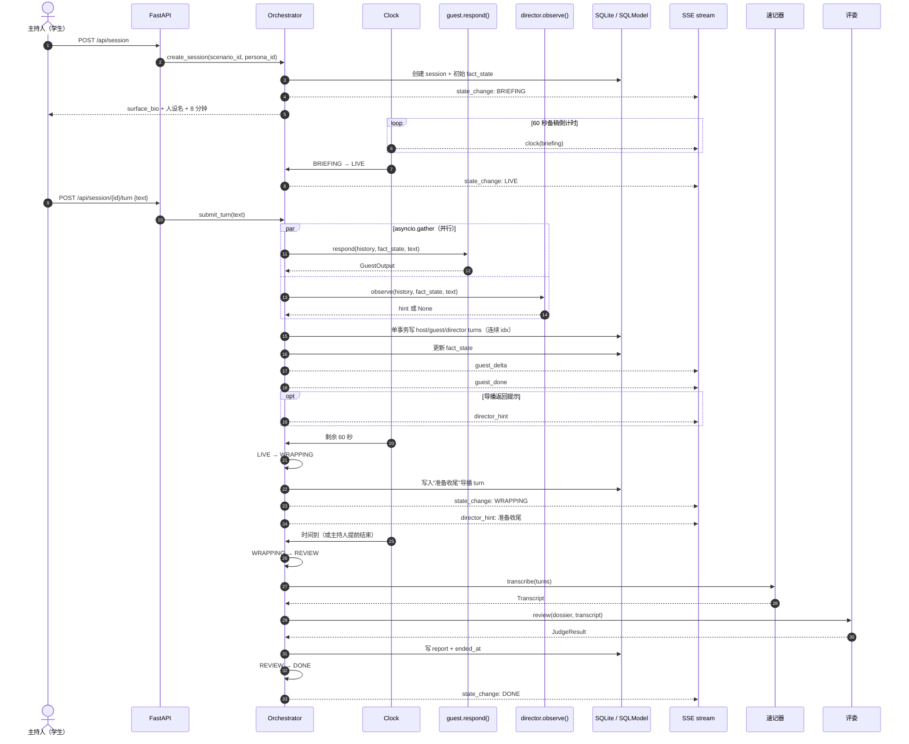

# 访谈编排时序

`LIVE` 中的嘉宾回答与导播观察由同一个 `asyncio.gather` 并行启动。两者都完成后，编排器才在同一事务中写入 turns 和 fact state，然后发布 SSE。

```mermaid
sequenceDiagram
    autonumber
    actor Host as 主持人（学生）
    participant API as FastAPI
    participant O as Orchestrator
    participant Clock as Clock
    participant Guest as guest.respond()
    participant Director as director.observe()
    participant DB as SQLite / SQLModel
    participant SSE as SSE stream
    participant Recorder as 速记器
    participant Judge as 评委

    Host->>API: POST /api/session
    API->>O: create_session(scenario_id, persona_id)
    O->>DB: 创建 session + 初始 fact_state
    O-->>SSE: state_change: BRIEFING
    O-->>Host: surface_bio + 人设名 + 8 分钟

    loop 60 秒备稿倒计时
        Clock-->>SSE: clock(briefing)
    end
    Clock->>O: BRIEFING → LIVE
    O-->>SSE: state_change: LIVE

    Host->>API: POST /api/session/{id}/turn {text}
    API->>O: submit_turn(text)
    par asyncio.gather（并行）
        O->>Guest: respond(history, fact_state, text)
        Guest-->>O: GuestOutput
    and
        O->>Director: observe(history, fact_state, text)
        Director-->>O: hint 或 None
    end
    O->>DB: 单事务写 host/guest/director turns（连续 idx）
    O->>DB: 更新 fact_state
    O-->>SSE: guest_delta
    O-->>SSE: guest_done
    opt 导播返回提示
        O-->>SSE: director_hint
    end

    Clock->>O: 剩余 60 秒
    O->>O: LIVE → WRAPPING
    O->>DB: 写入“准备收尾”导播 turn
    O-->>SSE: state_change: WRAPPING
    O-->>SSE: director_hint: 准备收尾

    Clock->>O: 时间到（或主持人提前结束）
    O->>O: WRAPPING → REVIEW
    O->>Recorder: transcribe(turns)
    Recorder-->>O: Transcript
    O->>Judge: review(dossier, transcript)
    Judge-->>O: JudgeResult
    O->>DB: 写 report + ended_at
    O->>O: REVIEW → DONE
    O-->>SSE: state_change: DONE
```
